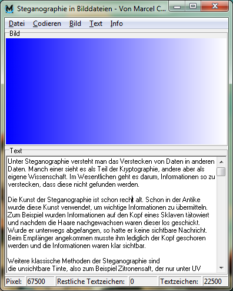
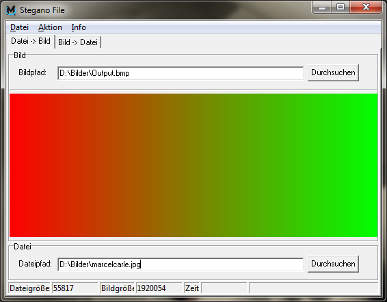

Steganography is the process of hiding data within other data. Some see it as part of cryptography, but others see it as a science of its
own. Essentially, it's about hiding information in such a way that it can't be found.

Already during school I wrote a research paper about steganography and created a program to store text in bitmap pictures.

Let me tell you more about steganography in the following sections.



## History

The art of steganography is quite old. Even in ancient times, this art was used to transmit important information.
For example, they tattooed something on the head of a slave and after the hair had grown back a bit, the information was not visible anymore
and he was sent off.
If he was intercepted on the way, he had no visible message.
Once he reached the recipient, all they had to do was shave his head and the information was clearly visible.

Other classic methods of steganography are:

* the **invisible ink**, for example lemon juice, which is only visible under UV light
* the **double bottom** for example in boxes
* the safe **behind a picture**

## Digital age

Steganography did not stop in the digital age. Nowadays, for example, information can be hidden in image or music files.
If you change the color of a pixel in an image to a minimal lighter or darker one, the human eye does not notice this change.
This can be done for each pixel, of which there are more than 2 million in a Full HD image.

Thus, a lot of information can be hidden in one image.

### Technique

A bitmap image is divided into three colors per pixel: Red, Green and Blue - RGB for short. Each color can have a value between 0 and 255,
so 2^8 = 256 different values.
If you combine these 3 color values, you get the color of the pixel. So there is a total of 2^8 * 2^8 * 2^8 = 2^24 = 16777216 different
colors that can be represented in a pixel.

If you change the last bit of a color, the so-called least significant bit (LSB), the color changes for the human eye to such a small degree
that hardly any difference can be detected.

Let's take the color (R: 123, G: 231, B: 42) as an example: &nbsp;&nbsp; █ \
Now we change the color minimally (R: 122, G: 230, B: 43): █

The eye will see no or hardly any difference between these two colors. If we now take into account that the color is normally only on one
pixel in an image, the eye will no longer see any difference.

A letter is typically represented by one byte (depending on the selected character encoding). If you want to store one byte in an image, you
need 3 pixels, because you use the LSB of each color value for each pixel. So you have 9 bits at your disposal. Here is an example:

Given you have the following three pixels:

<table>
<tbody>
  <tr>
  <td>&nbsp;</td>
  <th scope="col">R </th>
  <th scope="col">G</th>
  <th scope="col">B</th>
  <th></th>
  </tr>
<tr>
  <th scope="row">Pixel 1</th>
  <td>00110100</td>
  <td>10000101</td>
  <td>01110110</td>
  <td>█</td>
</tr>
<tr>
  <th scope="row">Pixel 2</th>
  <td>01111101</td>
  <td>10000001</td>
  <td>00100001</td>
  <td>█</td>
</tr>
<tr>
  <th scope="row">Pixel 3</th>
  <td>10011100</td>
  <td>00001110</td>
  <td>00000011</td>
  <td>█</td>
</tr>
</tbody>
</table>

If you would like to store the letter 'E', i.e. the binary code 01000101, you now get the new three pixels:

<table>
<tbody>
  <tr>
  <td>&nbsp;</td>
  <th scope="col">R </th>
  <th scope="col">G</th>
  <th scope="col">B</th>
  <th></th>
  </tr>
<tr>
  <th scope="row">Pixel 1</th>
  <td>0011010<b style="color: orange">0</b></td>
  <td>1000010<b style="color: orange">1</b></td>
  <td>0111011<b style="color: orange">0</b></td>
  <td>█</td>
</tr>
<tr>
  <th scope="row">Pixel 2</th>
  <td>0111110<b style="color: red">0</b></td>
  <td>1000000<b style="color: red">0</b></td>
  <td>0010000<b style="color: orange">1</b></td>
  <td>█</td>
</tr>
<tr>
  <th scope="row">Pixel 3</th>
  <td>1001110<b style="color: orange">0</b></td>
  <td>0000111<b style="color: red">1</b></td>
  <td>00000011</td>
  <td>█</td>
</tr>
</tbody>
</table>

As you can see, the pixels change only minimally, the first one even does not change at all.
If you apply this to an entire image with only 200x300 pixels, you can theoretically store over <b>20k characters</b> (with ASCII encoding).

Theoretically? Yes, as typically all images are compressed to reduce their size - well known is JPEG, which is a lossy compression,
i.e. it looses some information and therefore provides less potential.
But there are image formats (like BMP) where the statement above is true.

### Detecting

As good as the process of steganography sounds, it is sometimes quite easy to detect in images. By changing the LSB, one changes the noise
of the image. By means of a noise analysis, the LSBs are examined and assigned to a shade of gray.

#### Noise analysis onto logo

If you have a screenshot, a logo or other images made on the computer, there are usually areas of the same color on them.
Let's take my Cryptonify logo as an example.

| Original image |   With stored text   |
|:--------------:|:--------------------:|
|    ![logo]     |  ![logo-with-text]   |
|   ![na-logo]   | ![na-logo-with-text] |

As you can see in the noise analysis of the original image, you can recognize the same colored areas without any problems.
It's all quite regular and there are no big outliers. It is a natural noise for an image which was created with a computer.

The second image has the maximum amount of text saved into this image (as described earlier).
You may see some minor differences, but probably they both look equal to you. Even if you can spot differences, you most probably won't notice them without having the original image.

In the noise analysis of that image, you can still recognize the general shape, but there are no same colored ares - there is "noise"
everywhere.

#### Noise analysis onto photography

If you apply the noise analysis to photos, for example to my photo, it becomes more difficult:

| Original image |  With stored text  |
|:--------------:|:------------------:|
|     ![me]      |  ![me-with-text]   |
|    ![na-me]    | ![na-me-with-text] |

When you compare those two, you will find them less different compared with analyses of the logo. This is due to the natural noise, which
occurs with every camera image*1.
In the noise analysis of the original image you can still recognize my silhouette, but the natural noise is everywhere.
If you don't know the noise analysis of the original image, it is already more difficult to judge
whether there is information in this image or not.

<small>*1: In this case I converted an JPEG to BMP, i.e. the noise is not from photo only, but also from JPEG compression.</small>  

### Conclusion

Steganography can be quite easy to detect in digitally created images but might not be so simple in images with natural noise e.g. from a
camera.

The worst way to detect steganography is in random images, where each pixel has a random color, making the image completely "noisy".
But random images seem suspicious and are more likely to attract attention.

Instead, you could further optimize the algorithm to only store information in already noisy areas. It will reduce the amount of information
which can be stored, but it becomes nearly impossible to recognize.

Therefore, steganography remains a very interesting and quite secure method to hide information.
If hiding is not enough, the data can be additionally encrypted using cryptography. It is not an either or!

## Software

|                                                     Steganographie                                                      |                                         Stegano Fille                                          |
|:-----------------------------------------------------------------------------------------------------------------------:|:----------------------------------------------------------------------------------------------:|
| This is the program I developed during writing the research paper. You can store text as described into a BMP image |    This is a program I wrote shortly afterwards. It can store entire files into a BMP image    |
|                                                                                           |                                                                    |
|            {}Download (German){}             | {}Download (German){} |

You can also download and read my research paper {}here{}*2 (German).

<small>*2: Keep in mind, that I was 17 by the time I wrote that :wink:</small>

## More?

There were already some incidents, where a malware uses steganography to hide in a Windows logo: [Backdoor.Stegmap](https://www.google.com/search?q=Backdoor.Stegmap)

You can learn more about steganography and cryptography in a free eBook: https://www.anwalt.org/kryptographie/ (German).

[me]: images/me.bmp

[me-with-text]: images/me-with-text.bmp

[na-me]: images/me-lsb-na.bmp

[na-me-with-text]: images/me-with-text-lsb-na.bmp

[logo]: images/cryptonify-logo.bmp

[logo-with-text]: images/cryptonify-logo-with-text.bmp

[na-logo]: images/cryptonify-logo-lsb-na.bmp

[na-logo-with-text]: images/cryptonify-logo-with-text-lsb-na.bmp
